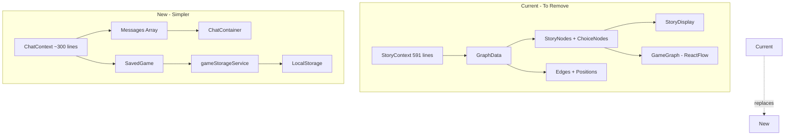
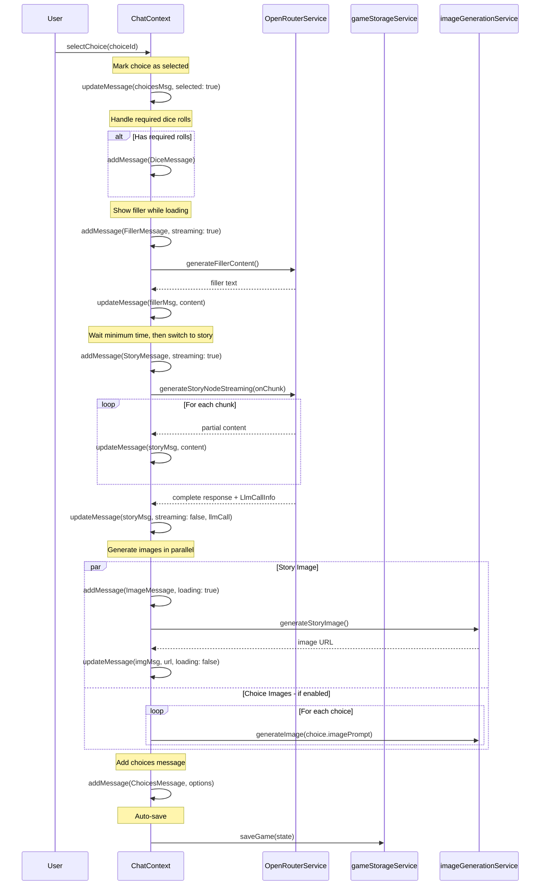

# Chat Dialog Architecture Plan

This document details the transformation from graph-based story nodes to a **chat dialog interface** with an old-school text adventure vibe.

---

## Design Goals

1. **Old-school text adventure feel** - scrolling chat with typewriter streaming
2. **Simplify massively** - remove ReactFlow graph complexity, reduce code
3. **Each card = one thing** - story, image, dice, choices as separate visual cards
4. **Preserve the 3D dice** - full-screen overlay animation
5. **Full persistence** - save/load games, branching support
6. **Visible LLM activity** - show API calls, costs, tokens on messages
7. **Mobile-first** - works on phone and desktop, no desktop-app tabs
8. **Chat is THE view** - character/rules/settings as overlays, not tabs

---

## Overview



---

## Phase 1: Type System Foundation

### ChatMessage Union Type

The key insight: **Story + Choices together form a "turn"**, but each element is its own card in the chat.

```typescript
// src/types.ts additions

interface BaseChatMessage {
  id: string;
  timestamp: Date;
  turnIndex?: number;   // Groups related messages (story + its choices)
}

// Story text - the main narrative content
interface StoryMessage extends BaseChatMessage {
  type: 'story';
  content: string;
  summary?: string;
  streaming?: boolean;        // True while content is being streamed
  llmCall?: LlmCallInfo;      // API call that generated this
  choices?: ChatChoice[];     // Choices attached to this story beat
  ttsEnabled?: boolean;       // Show TTS controls
}

// Image card - shows prompt while loading, then the image
interface ImageMessage extends BaseChatMessage {
  type: 'image';
  prompt: string;             // Always shown as context
  url?: string;               // Set when image is ready
  loading?: boolean;          // True while generating
  error?: string;             // If generation failed
}

// Dice roll with embedded 3D animation
interface DiceMessage extends BaseChatMessage {
  type: 'dice';
  rolls: RollResult[];        // Can have multiple rolls
  animationComplete?: boolean; // Controls whether to show animation or result
  description?: string;       // e.g., "Constitution Save DC 15"
}

// Atmospheric filler while waiting
interface FillerMessage extends BaseChatMessage {
  type: 'filler';
  content: string;
  fillerType: 'thoughts' | 'omen' | 'flavor';
  streaming?: boolean;
}

// System notifications
interface SystemMessage extends BaseChatMessage {
  type: 'system';
  message: string;
  variant: 'info' | 'success' | 'warning' | 'error' | 'character-update';
}

// Choice within a story - not a separate message type
interface ChatChoice {
  id: string;
  text: string;
  imagePrompt?: string;       // For generating preview image
  imageUrl?: string;          // Preview thumbnail
  requiredRolls?: DiceRoll[];
  selected?: boolean;         // User picked this
  disabled?: boolean;         // Can't be selected
}

type ChatMessage =
  | StoryMessage
  | ImageMessage
  | DiceMessage
  | FillerMessage
  | SystemMessage;
```

**Note**: Choices are now embedded in `StoryMessage.choices` rather than being a separate message type. This keeps each "turn" as a single story card with choices at the bottom.

### LLM Call Metadata

**Separate from cost tracking** - these are two different settings:
- `showCostTracking`: Shows session totals in header
- `showLlmCallInfo`: Shows per-message API details

```typescript
interface LlmCallInfo {
  id: string;
  timestamp: Date;
  model: string;
  promptTokens: number;
  completionTokens: number;
  totalTokens: number;
  estimatedCost: number;  // Calculated from model pricing
  duration: number;       // ms
  type: 'story' | 'filler' | 'character' | 'image-prompt' | 'story-plan';
}

// Settings for display preferences
interface DisplaySettings {
  showCostTracking: boolean;    // Session totals in header/footer
  showLlmCallInfo: boolean;     // Per-message API call details
}
```

### SavedGame Interface

```typescript
interface SavedGame {
  id: string;
  name: string;
  createdAt: Date;
  updatedAt: Date;
  
  // Character state
  characterSheet: string;
  
  // Story context
  storyPlan: string;
  themes: SelectedTheme[];
  
  // Chat history
  messages: ChatMessage[];
  
  // Branching support
  parentGameId?: string;           // If this game was branched from another
  branchFromMessageIndex?: number; // The message index where branch occurred
  
  // Cost tracking
  totalCost: number;
  totalTokens: number;
  llmCallCount: number;
}
```

### Image Settings

```typescript
interface ImageSettings {
  generateStoryImages: boolean;   // Image after story text (default: true)
  generateChoiceImages: boolean;  // Preview images for choices (default: false)
}
```

---

## Phase 2: ChatContext State Management

### State Structure

```typescript
interface ChatState {
  // Active game
  activeGameId: string | null;
  
  // Messages
  messages: ChatMessage[];
  
  // Loading states
  isGenerating: boolean;
  streamingMessageId: string | null;
  
  // Cost tracking for current session
  sessionCost: number;
  sessionTokens: number;
  sessionCalls: number;
}
```

### Key Functions

```typescript
interface ChatContextProps extends ChatState {
  // Message management
  addMessage: (message: ChatMessage) => void;
  updateMessage: (id: string, updates: Partial<ChatMessage>) => void;
  
  // Choice handling
  selectChoice: (choiceId: string) => Promise<void>;
  
  // Game management
  loadGame: (gameId: string) => Promise<void>;
  saveGame: () => Promise<void>;
  newGame: (characterSheet: string, themes: SelectedTheme[]) => Promise<void>;
  branchFromMessage: (messageIndex: number) => Promise<string>; // Returns new game ID
  
  // Utility
  getGameList: () => SavedGame[];
  deleteGame: (gameId: string) => void;
}
```

### Message Flow



---

## Phase 3: Persistence Layer

### Storage Keys

```typescript
// LocalStorage keys
const STORAGE_KEYS = {
  GAMES: 'acererak:games',           // SavedGame[] - all saved games
  ACTIVE_GAME: 'acererak:activeGame', // string - active game ID
  SETTINGS: 'acererak:settings',      // existing settings
  IMAGE_SETTINGS: 'acererak:imageSettings', // ImageSettings
};
```

### gameStorageService.ts

```typescript
// Core functions
export function listGames(): SavedGame[];
export function loadGame(id: string): SavedGame | null;
export function saveGame(game: SavedGame): void;
export function deleteGame(id: string): void;

// Active game management
export function getActiveGameId(): string | null;
export function setActiveGameId(id: string): void;

// Branching
export function createBranch(
  sourceGame: SavedGame, 
  fromMessageIndex: number
): SavedGame;

// Image settings
export function getImageSettings(): ImageSettings;
export function setImageSettings(settings: ImageSettings): void;
```

---

## Phase 4: Extended Streaming

### Choice Streaming Regex

Current regex extracts story content:
```typescript
const contentMatch = accumulated.match(/"content"\s*:\s*"((?:[^"\\]|\\.)*)(?:"|$)/);
```

New regex to extract choices progressively:
```typescript
// After story content is complete, look for choices
const choicesMatch = accumulated.match(/"choices"\s*:\s*\[(.*)/s);
if (choicesMatch) {
  // Extract individual choice objects as they complete
  const choiceRegex = /\{[^{}]*"text"\s*:\s*"([^"]+)"[^{}]*\}/g;
  let match;
  const partialChoices = [];
  while ((match = choiceRegex.exec(choicesMatch[1])) !== null) {
    partialChoices.push({ text: match[1] });
  }
  onPartialChoices(partialChoices);
}
```

### LLM Usage Capture

OpenRouter returns usage in response:
```typescript
const response = await openRouter.chat.completions.create({...});

// For non-streaming:
const usage = response.usage; // { prompt_tokens, completion_tokens, total_tokens }

// For streaming, usage comes in final chunk:
for await (const chunk of stream) {
  if (chunk.usage) {
    // Final chunk contains usage
  }
}
```

### Updated Schema - Add imagePrompt to Choices

```typescript
const schema = {
  // ... existing
  choices: {
    type: 'array',
    items: {
      type: 'object',
      properties: {
        text: { type: 'string' },
        nextNodeId: { type: 'string' },
        imagePrompt: { type: 'string' },  // NEW - scene preview for this choice
        requiredRolls: { /* ... */ },
      },
      required: ['text', 'nextNodeId', 'imagePrompt', 'requiredRolls'],
    },
  },
};
```

---

## Phase 5: Chat UI Components

### Component Hierarchy

```
ChatContainer.tsx                    ← Scrollable message list + header
├── ChatHeader.tsx                   ← Session cost, call count, game name
├── messages/
│   ├── StoryCard.tsx               ← Story text + choices + TTS (one card)
│   ├── ImageCard.tsx               ← Prompt shown, then image (square)
│   ├── DiceCard.tsx                ← Embedded 3D dice animation!
│   ├── FillerCard.tsx              ← "Meanwhile..." atmospheric text
│   └── SystemCard.tsx              ← Game events, errors, char updates
└── LlmCallBadge.tsx                ← Small badge showing cost, expandable
```

### Visual Layout - Full Restructure

**No tabs!** Chat is the entire view. Character/Rules/Settings accessible via icons in header.

```
┌──────────────────────────────────────────────────┐
│ ☰  ACERERAK     $0.45 | 12 calls   👤 📜 ⚙️     │  ← Hamburger, icons
├──────────────────────────────────────────────────┤
│                                                  │
│  ┌──────────────────────────────────────────┐   │
│  │ 📝 CHARACTER UPDATED              🤖$0.01│   │  ← SystemCard
│  │ +50 gold acquired                        │   │
│  │ -10 HP from trap damage                  │   │
│  └──────────────────────────────────────────┘   │
│                                                  │
│  ┌──────────────────────────────────────────┐   │
│  │ 💭 Meanwhile...                          │   │  ← Filler persists!
│  │ Your heart pounds as you sense           │   │
│  │ something watching from the shadows...   │   │
│  └──────────────────────────────────────────┘   │
│                                                  │
│  ┌──────────────────────────────────────────┐   │
│  │ 💀 STORY                          🤖$0.02│   │  ← LLM badge on card
│  │                                          │   │
│  │ The dungeon crumbles as ancient magic    │   │
│  │ tears through reality. Stone fragments   │   │
│  │ hover in the sulfurous air...            │   │
│  │                                          │   │
│  │ [🔊 Read Aloud]                          │   │  ← TTS controls
│  │                                          │   │
│  │ ─────────────────────────────────────    │   │
│  │ > Approach the altar cautiously          │   │  ← Choices inline
│  │ > Search for hidden traps                │   │
│  │ > Call out into the darkness             │   │
│  └──────────────────────────────────────────┘   │
│                                                  │
│  ┌──────────────────────────────────────────┐   │
│  │ 🎨 IMAGE                                 │   │
│  │ "Dark altar with glowing runes..."       │   │  ← Prompt always shown
│  │ ┌────────────────────────────────────┐   │   │
│  │ │                                    │   │   │
│  │ │      [Beautiful AI Image]          │   │   │  ← Square image
│  │ │                                    │   │   │
│  │ └────────────────────────────────────┘   │   │
│  └──────────────────────────────────────────┘   │
│                                                  │
│  ┌──────────────────────────────────────────┐   │
│  │ 🎲 DICE ROLL                             │   │
│  │ Constitution Save DC 15                  │   │
│  │ Rolled: 13 + 5 = 18 ✓ SUCCESS            │   │
│  └──────────────────────────────────────────┘   │
│                                                  │
└──────────────────────────────────────────────────┘

Header Icons:
☰ = Hamburger menu (Games list, New Game, Start Over)
👤 = Character sheet (slide-in panel)
📜 = Rules panel (slide-in panel)
⚙️ = Settings (slide-in panel)
```

### Hamburger Menu Contents

```
┌─────────────────────┐
│ Your Adventures     │
├─────────────────────┤
│ • Desert Revenge ✓  │  ← Current game
│ • Tomb of Horrors   │
│ • The Void Below    │
│   └─ Branch 1       │
├─────────────────────┤
│ + New Adventure     │
│ ↩ Start Over        │  ← Restarts current
├─────────────────────┤
│ Delete Game...      │
└─────────────────────┘
```

### Mobile Responsive

**Mobile (<768px):**
- Full-width cards with minimal padding
- Touch-friendly choice buttons
- Panels slide in from right, **take full width**
- Dimmed overlay behind panel
- Click overlay or X to close

**Desktop (≥768px):**
- Max-width container (~800px) centered
- Panels slide in from right as **400px sidebar**
- Rest of chat visible but **dimmed**
- Click overlay or X to close
- More generous spacing

**Panel Behavior:**
- One panel open at a time
- Opening new panel closes previous
- Panels: Character (👤), Rules (📜), Settings (⚙️), Games (☰)

### Embedded Dice Animation

The dice animation will be **embedded inside the DiceCard** in a smaller viewport:

**How it works:**
1. User clicks choice that requires roll
2. DiceCard is created with `animating: true` state
3. Card shows 3D viewport (~300px tall) with dice animation
4. Result is pre-calculated but NOT shown yet (user thinks animation determines it)
5. Story generation starts in parallel (using the result)
6. When dice settle, result text fades in: "18 ✓ SUCCESS"
7. Story continues streaming

**Technical approach:**
- Render Three.js into a container div inside the card (not document.body)
- Keep camera/lighting settings unchanged (may crop slightly, that's fine)
- Pass container ref to DiceAnimation component
- Result text appears after `onAnimationComplete` callback

---

## Choice Flow Sequences

### Scenario A: Choice WITHOUT Dice Rolls

```
User clicks "Approach altar cautiously"
  ↓
1. Mark choice as selected in StoryCard
2. FillerCard appears (streaming "Meanwhile...")
3. StoryCard starts streaming (new story)
4. ImageCard appears (shows prompt, loading state)
5. Story completes, choices appear in new StoryCard
6. ImageCard finishes loading
```

### Scenario B: Choice WITH Dice Rolls

```
User clicks "Attempt to pick the lock (Dex DC 15)"
  ↓
1. Mark choice as selected in StoryCard
2. DiceCard appears (shows embedded 3D animation)
3. Animation plays, dice settle
4. Result text fades in: "12 + 3 = 15 ✓ SUCCESS"
5. FillerCard appears (based on result context)
6. StoryCard starts streaming (LLM received result during animation)
7. ImageCard appears (loading)
8. Story completes with choices
9. ImageCard finishes
```

**Key timing:** Story generation starts in parallel with dice animation.
The LLM begins generating during animation so result is ready faster.

---

## LLM Context Strategy

**For story generation, include:**
- Full character sheet (current state)
- Story plan (generated at game start)
- Full message history (all story content)

**Future optimization (not this phase):**
- Context compression for long games
- Summarize older turns
- Configurable context window

---

## Implementation Details

### Auto-scroll Behavior
- When new cards are added, auto-scroll to bottom of chat
- Smooth scroll animation
- New content appears at bottom, scrolls into view

### Error Handling
- If API call fails, show error on the relevant card (StoryCard shows error state)
- Filler cards that were created before error remain visible
- Optional: Add retry button if easy to implement, otherwise just show error

### DiceAnimation Embedding
Current [`DiceAnimation.tsx`](src/components/DiceAnimation.tsx) creates full-screen container.

**Modification needed:**
```typescript
interface DiceAnimationProps {
  roll: RollResult;
  onAnimationComplete?: () => void;
  containerRef?: React.RefObject<HTMLDivElement>;  // NEW - render target
}

// In component:
// If containerRef provided, render into it
// Otherwise, create document.body overlay (backwards compatible)
```

Keep all camera, lighting, physics logic unchanged. Just change where the Three.js canvas is mounted.

### LlmCallBadge Component

Small inline badge on cards that triggered LLM calls:
```
┌─────────────┐
│ 🤖 $0.02    │  ← Collapsed (default)
└─────────────┘

Click to expand:
┌─────────────────────────────────────┐
│ Model: claude-sonnet-4              │
│ Tokens: 1,234 → 456 (1,690 total)   │
│ Cost: ~$0.018                       │
│ Duration: 3.2s                      │
└─────────────────────────────────────┘
```

---

## Phase 6: Image Generation for Choices

### Settings UI Addition

Add to Settings.tsx:
```typescript
<div className="settings-section">
  <h2>Image Generation</h2>
  <label>
    <input type="checkbox" checked={settings.generateStoryImages} />
    Generate images for story scenes
  </label>
  <label>
    <input type="checkbox" checked={settings.generateChoiceImages} />
    Generate preview images for choices (increases API costs)
  </label>
</div>
```

### Choice Image Flow

When story generation completes and `generateChoiceImages` is enabled:

1. Create ImageMessage for each choice (loading state)
2. Generate images in parallel
3. Update ChoicesMessage with image URLs
4. Display thumbnails on hover or inline

---

## Phase 7: Game Management

### GameSidebar / Modal

```
┌────────────────────────────────┐
│ Your Adventures                │
├────────────────────────────────┤
│ • Dark Ritual (active)         │
│   Last played: 2 min ago       │
│   12 turns | $0.45             │
│                                │
│ • Tomb of Horrors              │
│   Last played: Yesterday       │
│   45 turns | $2.10             │
│   └─ Branch: What if?          │
│                                │
│ • The Void Below               │
│   Last played: 3 days ago      │
│   8 turns | $0.22              │
├────────────────────────────────┤
│ [+ New Adventure]              │
└────────────────────────────────┘
```

### Branching UX

On story messages, add context menu or button:
- "Branch from here" → Creates new SavedGame
- Copies messages up to that point
- Sets `parentGameId` and `branchFromMessageIndex`
- Opens new branch as active game

---

## Phase 8: Integration & Cleanup

### Files to Create
```
src/contexts/ChatContext.tsx           # New context (~300 lines)
src/services/gameStorageService.ts     # LocalStorage operations
src/components/chat/
├── ChatContainer.tsx                  # Main scrollable container
├── ChatContainer.css                  # Chat styling
├── ChatHeader.tsx                     # Session info, game name
├── cards/
│   ├── StoryCard.tsx                  # Story + choices + TTS
│   ├── ImageCard.tsx                  # Prompt + square image
│   ├── DiceCard.tsx                   # Animation + result
│   ├── FillerCard.tsx                 # Atmospheric text
│   └── SystemCard.tsx                 # Notifications
├── cards/cards.css                    # Shared card styling
├── LlmCallBadge.tsx                   # Expandable cost badge
└── GameList.tsx                       # Saved games modal/sidebar
```

### Files to DELETE (big cleanup!)
```
src/components/GameGraph.tsx          # 197 lines - ReactFlow
src/components/StoryDisplay.tsx       # 226 lines - replaced by ChatContainer
src/components/StoryDisplay.css       # styling for old component
src/components/GameTabs.tsx           # 70 lines - no more tabs!
src/components/GameTabs.css           # tab styling
src/contexts/StoryContext.tsx         # 591 lines - replaced by ChatContext
```

**Total lines removed: ~1,100+ lines!**

### Files to Modify
```
src/types.ts                          # Remove GraphData/Edge/positions
src/contexts/GameContext.tsx          # Simplify, use ChatContext
src/services/openRouterService.ts     # Return LlmCallInfo
src/components/Settings.tsx           # Add image + display settings
src/components/Layout.tsx             # Chat is main view, panels for others
src/components/CharacterSheet.tsx     # Convert to slide-in panel
src/components/RulesPanel.tsx         # Convert to slide-in panel
package.json                          # Remove reactflow deps
```

### Dependencies to Remove
```bash
npm uninstall reactflow @reactflow/background
```

### Types to Remove from src/types.ts
```typescript
// DELETE these - no longer needed
export interface Edge { ... }
export interface GraphData { ... }
// Remove position fields from StoryNode/ChoiceNode

// Keep these
export interface DiceRoll { ... }
export interface RollResult { ... }
export interface SelectedTheme { ... }
export interface StoryGenerationResponse { ... }  // Modified
```

---

## Migration Strategy

### Why This is Simpler

| Current | New |
|---------|-----|
| StoryContext (591 lines) | ChatContext (~300 lines) |
| GraphData with nodes/edges | Simple messages array |
| Position tracking | Just append to array |
| Complex node relationships | Linear chat history |
| ReactFlow rendering | Simple map over messages |

### Migration Steps

1. **Build ChatContext alongside StoryContext** - both can exist temporarily
2. **Create ChatContainer using mock data** - test UI independently
3. **Wire real data** - switch ChatContext to use openRouterService
4. **Swap in GameTabs** - replace StoryDisplay with ChatContainer
5. **Delete old code** - remove StoryContext, GameGraph, StoryDisplay
6. **Clean up types** - remove GraphData, Edge, positions

### No Data Migration Needed

Current graph data isn't persisted. New SavedGame format starts fresh.

---

## Cost Calculation Reference

Model pricing (per 1M tokens) for cost estimates:
```typescript
const MODEL_PRICING: Record<string, { input: number; output: number }> = {
  'anthropic/claude-sonnet-4': { input: 3, output: 15 },
  'anthropic/claude-haiku-3.5': { input: 0.8, output: 4 },
  'openai/gpt-4-turbo': { input: 10, output: 30 },
  'openai/gpt-4o': { input: 2.5, output: 10 },
  'openai/gpt-4o-mini': { input: 0.15, output: 0.6 },
};

function estimateCost(model: string, promptTokens: number, completionTokens: number): number {
  const pricing = MODEL_PRICING[model] || { input: 1, output: 2 };
  return (promptTokens * pricing.input + completionTokens * pricing.output) / 1_000_000;
}
```

---

## Summary of Design Decisions

Based on discussion:

| Decision | Choice |
|----------|--------|
| Story + Choices grouping | **Together in one StoryCard** |
| Images | **Own card, show prompt, square aspect** |
| Dice animation | **Embedded in DiceCard** (smaller viewport, same rendering) |
| Branch naming | **Auto-generate from game state** |
| Cost tracking | **Separate setting from LLM call info** |
| TTS controls | **On story cards** |
| Character updates | **SystemCard in chat** (not in story card) |
| Filler cards | **Persist** after story loads |
| Game naming | **Auto from themes** (e.g., "Desert Revenge") |
| UI structure | **Full restructure** - chat is main view, no tabs |
| Panels | **Slide-in, one at a time, dimmed overlay** |
| Game persistence | **Auto-save always** |
| Game start | **No filler, show chat immediately with streaming story** |
| Branching | **Immediate switch, auto-name** |
| Setup flow | **Wizard → chat (existing flow, refactor later)** |
| Hamburger menu | **Games list, New Game, Settings access** |
| Start Over | **In hamburger menu** |
| Transition | **Instant swap to chat (no animation)** |

---

## Next Steps

Ready to implement! Recommended order:

1. **Types first** - Add ChatMessage types to types.ts
2. **Storage service** - gameStorageService.ts for persistence
3. **ChatContext** - Core state management
4. **UI Cards** - Build each card component
5. **ChatContainer** - Wire it all together
6. **Integration** - Swap into GameTabs
7. **Cleanup** - Delete old code, remove deps